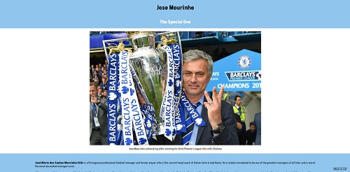

# Responsive Tribute Page - A Jose Mourinho Tribute Page

This mini project was made as part of the [freeCodeCamp](https://www.freecodecamp.org/learn/) Responsive Web Design certification course. 

The brief was to build a [CodePen.io](codepen.io) app that is functionally similar to this: https://codepen.io/freeCodeCamp/full/zNqgVx.

My original CodePen can be viewed [here](https://codepen.io/nickchapman1988/pen/popYyZa)

In addition, several user stories were specified to be met. These were as follows:

<table>
    <tr>
    <th>STORY ID</th>
    <th>USER STORY</th>
    </tr>
    <tr>
    <td>User Story #1:</td>
    <td>My tribute page should have an element with a corresponding id="main", which contains all other elements.</td>
    </tr>
    <tr>
    <td>User Story #2:</td>
    <td>I should see an element with a corresponding id="title", which contains a string (i.e. text) that describes the subject of the tribute page (e.g. "Dr. Norman Borlaug").</td>
    </tr>
    <tr>
    <td>User Story #3:</td>
    <td>I should see either a figure or a div element with a corresponding id="img-div".</td>
    </tr>
    <tr>
    <td>User Story #4:</td>
    <td>Within the img-div element, I should see an img element with a corresponding id="image".</td>
    </tr>
    <tr>
    <td>User Story #5:</td>
    <td>Within the img-div element, I should see an element with a corresponding id="img-caption" that contains textual content describing the image shown in img-div.</td>
    </tr>
    <tr>
    <td>User Story #6:</td>
    <td>I should see an element with a corresponding id="tribute-info", which contains textual content describing the subject of the tribute page.</td>
    </tr>
    <tr>
    <td>User Story #7:</td>
    <td>I should see an a element with a corresponding id="tribute-link", which links to an outside site that contains additional information about the subject of the tribute page. HINT: You must give your element an attribute of target and set it to _blank in order for your link to open in a new tab (i.e. target="_blank").</td>
    </tr>
    <tr>
    <td>User Story #8:</td>
    <td>The img element should responsively resize, relative to the width of its parent element, without exceeding its original size.</td>
    </tr>
    <tr>
    <td>User Story #9:</td>
    <td>The img element should be centered within its parent element.</td>
    </tr>
</table> 

